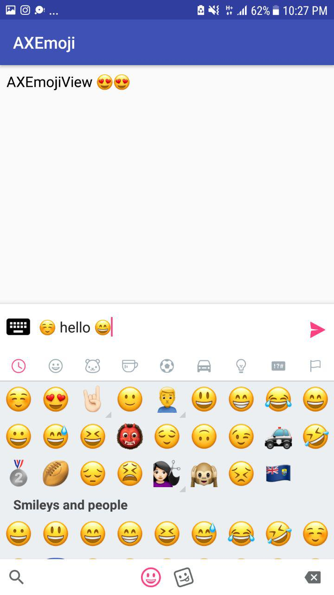
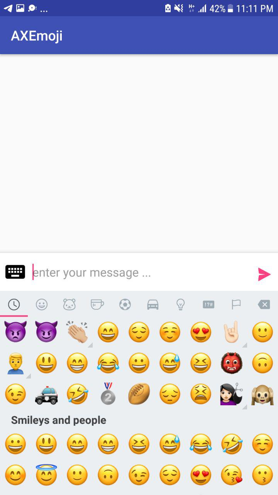
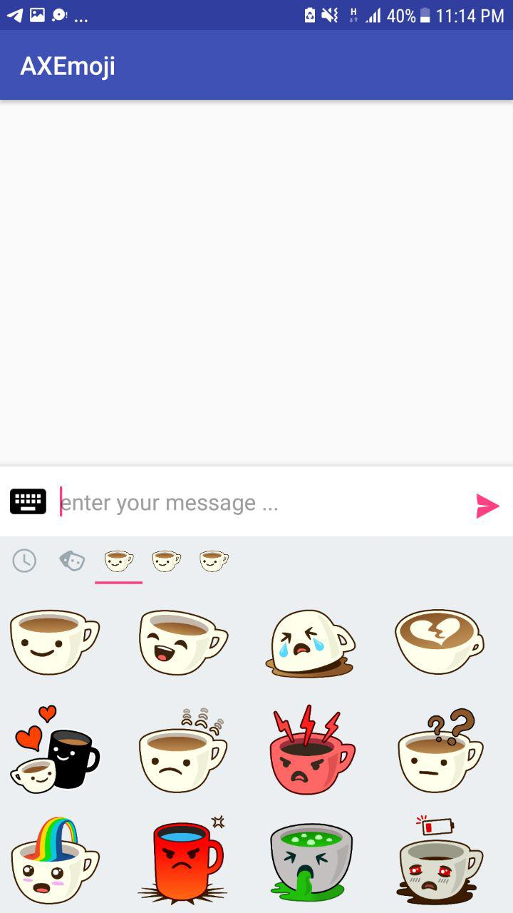
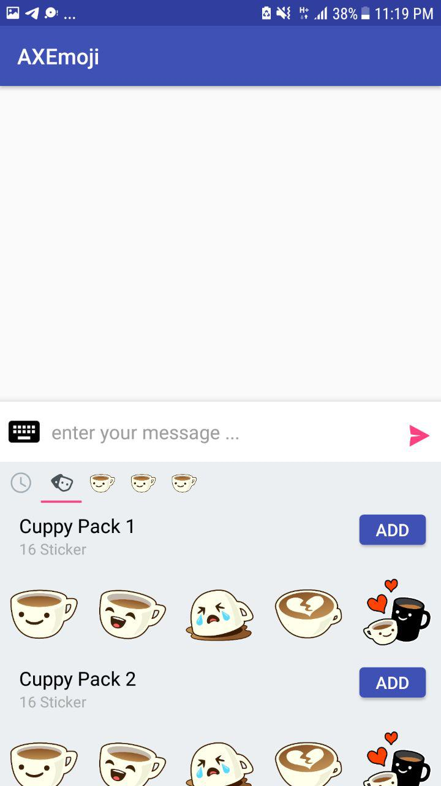
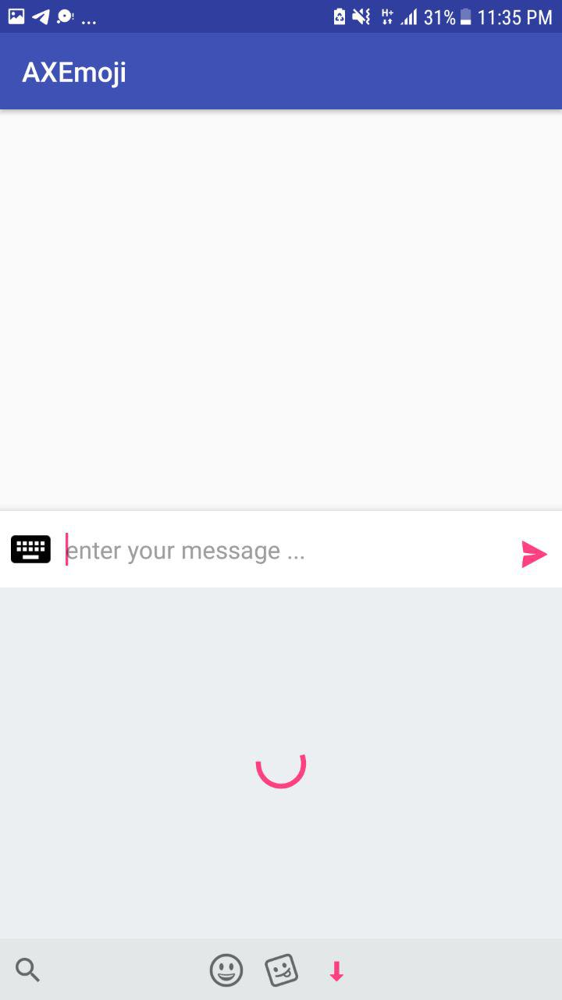
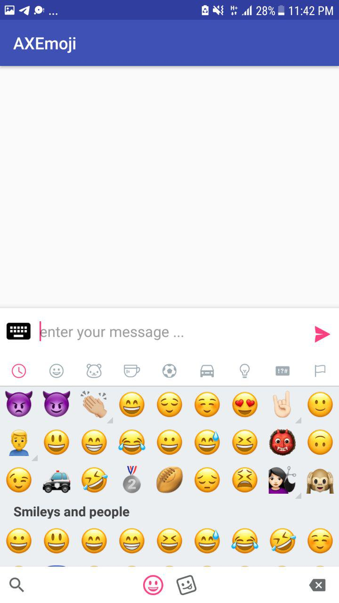

# AXEmojiView
an advanced library to add Emoji-Sticker-... Support to your Android application.



The library has 4 different providers to choose from (iOS, Google, Twitter & Emoji One).

## Install Emoji Provider 
```java
AXEmojiManager.install(this,new AXIOSEmojiProvider());
```

   
AXIOSEmojiProvider  -  AXGoogleEmojiProvider  -  AXTwitterEmojiProvider  -  AXEmojiOneProvider

### Custom Emojis
If you want to display your own Emojis you can create your own implementation of [`EmojiProvider`](AXEmojiView/AXEmojiView/src/main/java/com/aghajari/axemojiview/emoji/EmojiProvider.java) and pass it to `AXEmojiManager.install`.

## Basic Usage

create [`AXEmojiEditText`](AXEmojiView/AXEmojiView/src/main/java/com/aghajari/axemojiview/view/AXEmojiEditText.java) in your layout xml file.
```xml
<com.aghajari.axemojiview.view.AXEmojiEditText
            android:id="@+id/edt"
            android:layout_width="match_parent"
            android:layout_height="match_parent"
            android:hint="enter your message ..." />
```

now create a page : AXEmojiView - AXSingleEmojiView - AXStickerView

```java
AXEmojiEditText = findViewById(R.id.edt);

AXEmojiView emojiView = new AXEmojiView(this);
emojiView.setEditText(edt);
```

and add page to AXEmojiPopup :
```java
AXEmojiPopup emojiPopup = new AXEmojiPopup(emojiView);
emojiPopup.toggle(); // Toggles visibility of the Popup.
emojiPopup.dismiss(); // Dismisses the Popup.
emojiPopup.isShowing(); // Returns true when Popup is showing.
```

Result :


### Single Emoji View
Single Emoji View is a recycler view with all emojis in one page (same as Telegram Inc)

```java
AXSingleEmojiView emojiView = new AXSingleEmojiView(this);
emojiView.setEditText(edt);

AXEmojiPopup emojiPopup = new AXEmojiPopup(emojiView);
```

Result :



### StickerView

You need to create You StickerProvider and load stickers from url - res - bitmap or anything you want with your StickerLoader . see example : [`WhatsAppProvider`](./AXEmojiView/app/src/main/java/com/aghajari/axemoji/sticker/WhatsAppProvider.java)
```java
AXStickerView stickerView = new AXStickerView(this , "stickers" , new MyStickerProvider());

AXEmojiPopup emojiPopup = new AXEmojiPopup(stickerView);
```

Result :



Add custom page to StickerProvider . see example : [`ShopStickers`](./AXEmojiView/app/src/main/java/com/aghajari/axemoji/sticker/ShopStickers.java)

Result :



## Use Sticker & Emoji together
you can create AXEmojiPager and add your pages to your page.

Enable Footer view in theme settings (if you want) :
```java
AXEmojiManager.getTheme().setFooterEnabled(true);
```

and create your emoji pager :
```java
AXEmojiPager emojiPager = new AXEmojiPager(this);

AXSingleEmojiView singleEmojiView = new AXSingleEmojiView(this);
emojiPager.addPage(singleEmojiView, R.drawable.ic_msg_panel_smiles);

AXStickerView stickerView = new AXStickerView(this, "stickers", new WhatsAppProvider());
emojiPager.addPage(stickerView, R.drawable.ic_msg_panel_stickers);

emojiPager.setSwipeWithFingerEnabled(true);
emojiPager.setEditText(edt);
AXEmojiPopup emojiPopup = new AXEmojiPopup(emojiPager);
```

add left view (ex. search) to emojiPager :
```java
emojiPager.setLeftIcon(R.drawable.ic_ab_search);
        
        //Click Listener
        emojiPager.setOnFooterItemClicked(new AXEmojiPager.onFooterItemClicked() {
            @Override
            public void onClick(boolean leftIcon) {
                if (leftIcon) Toast.makeText(EmojiActivity.this,"Search Clicked",Toast.LENGTH_SHORT).show();
            }
        });
```

Result :


### Create Your Custom Page
create a viewGroup and extend View to AXEmojiBase.
add your custom view to emojiPager

Ex.[`LoadingPage`](./AXEmojiView/app/src/main/java/com/aghajari/axemoji/customs/LoadingView.java)

```java
emojiPager.addPage(new LoadingView(this), R.drawable.msg_round_load_m);
```

Result :



## Customize Theme
Customize theme with AXEmojiManager.getTheme or set your theme (AXEmojiTheme class)
```java
AXEmojiManager.getTheme().setSelectionColor(0xffFF4081);
AXEmojiManager.getTheme().setFooterSelectedItemColor(0xffFF4081);
AXEmojiManager.getTheme().setFooterBackgroundColor(Color.WHITE);
AXEmojiManager.getTheme().setSelectionColor(Color.TRANSPARENT);
AXEmojiManager.getTheme().setSelectedColor(0xffFF4081);
AXEmojiManager.getTheme().setCategoryColor(Color.WHITE);
AXEmojiManager.getTheme().setAlwaysShowDivider(true);
AXEmojiManager.getTheme().setBackgroundColor(Color.LTGRAY);

AXEmojiManager.getStickerViewTheme().setSelectedColor(0xffFF4081);
AXEmojiManager.getStickerViewTheme().setCategoryColor(Color.WHITE);
AXEmojiManager.getStickerViewTheme().setAlwaysShowDivider(true);
AXEmojiManager.getStickerViewTheme().setBackgroundColor(Color.LTGRAY);
```

Result :



## Views
AXEmojiEditText
AXEmojiMultiAutoCompleteTextView
AXEmojiButton
AXEmojiImageView
AXEmojiTextView

## Listeners
onEmojiActions :
```java
    void onClick (View view, Emoji emoji, boolean fromRecent, boolean fromVariant);
    void onLongClick (View view, Emoji emoji, boolean fromRecent, boolean fromVariant);
```

onStickerActions :
```java
    void onClick(View view, Sticker sticker, boolean fromRecent);
    void onLongClick(View view, Sticker sticker, boolean fromRecent);
```

onEmojiPagerPageChanged :
```java
    void onPageChanged (AXEmojiPager emojiPager, AXEmojiBase base, int position);
```

PopupListener :
```java
    void onDismiss();
    void onShow();
    void onKeyboardOpened(int height);
    void onKeyboardClosed();
```

## Set Custom View Text with emojis
first you need to get Unicode of emoji :
```java
String unicode = AXEmojiUtils.getEmojiUnicode(0x1f60d); // or Emoji.getUnicode();
```
now set it to your view with AXEmojiUtils.replaceWithEmojis.
Ex. set actionbar title :
```java
String title = "AXEmojiView " + unicode;
getSupportActionBar().setTitle(AXEmojiUtils.replaceWithEmojis(this, title, 20));
```

Result :


## RecentManagers
add your custom recentManager for emojis and stickers . implements to RecentEmoji/RecentSticker
```java
AXEmojiManager.setRecentEmoji(emojiRecentManager);
AXEmojiManager.setRecentSticker(stickerRecentManager);
```

disable recent managers :
```java
AXEmojiManager.getInstance().disableRecentManagers();
```

## Emoji Loader
you can add an custom emoji loader with AXEmojiLoader :
```java
AXEmojiManager.setEmojiLoader(new EmojiLoader(){
  @Override
  public void loadEmoji (AXEmojiImageView imageView,Emoji emoji){
   imageView.setImageDrawable(emoji.getDrawable(imageView.getContext());
  }
});
```

## Author 
Amir Hossein Aghajari

Telegram : @KingAmir272
